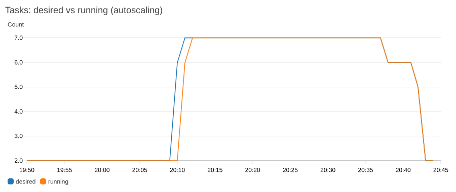

# Resilient collections voice agent

A voice agent for loan-collection calls. Each thing a caller says goes through **speech-to-text → LLM → text-to-speech**. The point of the project is what happens when those models fail: the call keeps going, and nothing the caller said is lost.

- **Retries** with backoff and jitter, inside a per-turn deadline.
- **A circuit breaker per stage**, so a dead model is not hammered.
- **A fallback prompt** (or a handoff to a human) when a turn cannot complete.
- **A dead-letter queue**: every failed turn is saved, can be inspected, and can be replayed later.

Round 1 built and tested this locally against a mock provider that fails 20% of requests. Round 2 deployed it to AWS with Terraform, autoscaling, a CloudWatch dashboard and a live load test against real open-weight models.

## Results from the AWS load test

A 35-minute campaign on 9 October 2026, with 20% of model calls failing on purpose and a full LLM outage in the middle ([details](docs/load-test-results.md)):

| | |
|---|---|
| Turns handled | 522, with **0 failed HTTP requests** |
| Autoscaling | 2 → 7 tasks within 3 minutes of the spike, back down afterwards |
| LLM outage (60 s) | Breaker opened in 45 s; callers got a fallback; 64 dead letters, all replayed |
| Teardown | `terraform destroy` removed 73 resources; [check log](teardown) shows nothing billable left |



## Run it locally

You need Python 3.11+ and [uv](https://docs.astral.sh/uv/). No AWS account, API keys or GPU.

```bash
uv sync
uv run pytest -q                    # ~280 tests, about 40 s

uv run voice-agent mock --port 9000 # terminal 1: mock models, 20% failure rate
uv run voice-agent serve            # terminal 2: the service on :8080 (API docs at /docs)
uv run voice-agent loadtest         # terminal 3: 50 calls, 4 turns each
uv run voice-agent chaos-demo       # LLM outage -> breaker opens -> recovery -> replay
```

Or with Docker: `docker compose up --build`.

Look at the dead letters:

```bash
uv run voice-agent dlq list
uv run voice-agent dlq replay --all
```

## How it works

```
POST /v1/calls/{call_id}/turns
  └─ TurnPipeline (per-turn deadline)
       ├─ save the turn as in_progress
       ├─ STT ─► LLM ─► TTS     each wrapped as Retry(Breaker(Timeout(call)))
       ├─ success: save as completed, return the reply audio
       └─ failure: in ONE transaction, mark the turn degraded and write a dead letter,
                   then return a pre-recorded fallback (retry prompt, or handoff after 2 in a row)
```

- **Providers are swappable.** The pipeline only knows three small interfaces. Switching from the mock to real models (faster-whisper, vLLM or llama.cpp, Kokoro) is configuration, not code: see [`docker-compose.openweight.yml`](docker-compose.openweight.yml).
- **Failures are classified.** Timeouts, 5xx, 429 and garbage responses are retried and count against the breaker. A 4xx means our request is wrong, so it is not retried and never trips the breaker.
- **The breaker opens at 60% failures** over its last 50 calls. The normal 20% failure rate never trips it, and a real outage trips it within about 9 turns.
- **Nothing is lost.** A turn is saved before any model is called, and a crash mid-turn is picked up and dead-lettered on restart.

The full details (thresholds and why, replay semantics, configuration, tests) are in [docs/failure-handling.md](docs/failure-handling.md).

## On AWS

```
 load generator ──► ALB (only my IP) ──► ECS Fargate "voice-agent" (private subnets, 2-10 tasks)
                                            │ scales on active calls per task (custom metric)
                                            │ DynamoDB: turns + dead letters
                                            ▼
                                internal NLB ──► model server (EC2, private subnet)
                                                 chaos proxy (20% failures) ─► LLM, STT, TTS
```

Everything is built by one `terraform apply` in [`infra/`](infra). It includes:
- a VPC with private subnets and a NAT gateway;
- least-privilege IAM roles, with a script that rejects any wildcard permission;
- a CloudWatch dashboard and alarms;
- a dead-man switch that turns the model server off after 3 hours.

Two things differ from the brief, both documented:

- **Region: Sydney, not Mumbai.** The AWS account's organization only allows ap-southeast-2. Mumbai is one variable away: `-var region=ap-south-1`. Why Mumbai is the right production choice: [docs/region-notes.md](docs/region-notes.md).
- **Models on CPU, not GPU.** AWS declined the GPU quota for the new account. With Predixion's approval, the models run on an 8-core CPU server (Qwen2.5-1.5B, faster-whisper, Kokoro) with a lighter campaign. `model_tier = "gpu"` deploys the original g5.xlarge design. Details: [docs/cpu-model-tier.md](docs/cpu-model-tier.md).

To deploy it yourself, follow [docs/aws-deployment.md](docs/aws-deployment.md). To operate it when an alarm fires, use [RUNBOOK.md](RUNBOOK.md).

## Cost

| | Estimate (CPU tier) | Measured |
|---|---|---|
| Total for Round 2 | about $4.65 (about $6 with a buffer) | Cost Explorer, final figure to follow (AWS data lags a day) |

The model server and the NAT gateway dominate. Spend was capped by a $10 budget with email alerts, the 3-hour dead-man switch, and a destroy after every session. The line-by-line estimate is in [docs/aws-deployment.md](docs/aws-deployment.md#cost); `uv run python -m cost.measured --start 2026-10-08 --end 2026-10-11` reports actual spend by service.

## Repository layout

```
src/voice_agent/     the service: API, pipeline, resilience layer, dead-letter queue, stores
src/mock_provider/   mock models and the chaos proxy used on AWS
infra/               Terraform for AWS
scripts/             IAM check, teardown check, chaos control
cost/                cost model and measured-spend report
tests/               unit, contract and end-to-end tests
docs/                design docs, load-test results, deployment guide
teardown/            proof that nothing was left running
```

CI runs the tests, `ruff`, `mypy --strict`, a Docker build and `terraform validate` on every push.
